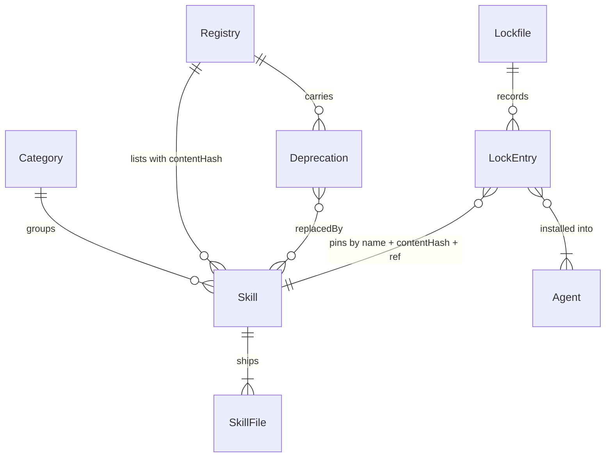

# Mass Solutions Skills: catálogo público de skills com governança privada

Sources:

- `.design/mass-solutions-skills.md` (tlc-discover, 2026-09-14) - problema, veredito, forma, roadmap e a tabela `Decisions`; toda linha da tabela é tratada aqui como confirmada pelo usuário
- `DESIGN.md` - referência dos tokens visuais do site (cores, tipografia, componentes); vira **binding for the interface** somente se o perfil `ui` for escolhido (ver Assumptions)
- https://agentskills.io/specification - contrato de frontmatter: chaves permitidas, `name` 1-64 chars `[a-z0-9-]` igual à pasta, `description` 1-1024, `compatibility` 1-500, `metadata` mapa string→string, corpo recomendado abaixo de 500 linhas
- https://github.com/vercel-labs/skills (README, CLI 1.5.26) - descoberta em `skills/`, `.claude/skills/`, `.agents/skills/` até 3 níveis; lê `.claude-plugin/marketplace.json` e `plugin.json` como **adição** ao conjunto; aceita caminho local (`npx skills add ./dir --list`); ids e paths dos agentes; sem lockfile nem hash
- https://code.claude.com/docs/en/plugin-marketplaces - esquema de `marketplace.json`, `source: "./"` + `skills: ["./skills/"]`, `claude plugin marketplace add ./dir`, `claude plugin validate .`
- https://github.com/snyk/agent-scan - `uvx snyk-agent-scan@latest <path> --ci`, `SNYK_TOKEN`, `--ignore-risks NAMES`; não há arquivo de allowlist próprio
- Astro docs via Context7 (`/withastro/docs`, v6) - `i18n.routing.prefixDefaultLocale` (default `false` no v6), `glob({ pattern, base })`, `site` + `base` para GitHub Pages, Node mínimo `22.12.0`
- Verificado nesta sessão: `npx skills add ./ --list` neste diretório lista `tlc-discover` e `tlc-spec-lean` (tooling em `.claude/skills/`); toolchain local Node 24.14.1, pnpm 11.23.0, gh 2.92.0 autenticado como `maiconsouza89`, uvx 0.11.29, claude 2.1.271

## Problem

A Mass Solutions escreve skills para agentes de código e não tem onde publicá-las: hoje cada skill vive copiada à mão em `.claude/skills/` de projeto em projeto, sem dono declarado, sem versão, sem data de revisão e sem forma de um terceiro instalá-la ou receber atualização. O único instalador aberto (`npx skills`) instala de qualquer repo público, mas não verifica integridade do que baixou; o rascunho `maiconsouza89/mass-agents-skills`, gerado sem revisão, está público com a marca e um site no ar, concorrendo com o que ainda não existe. Evidência do discovery: 0 skills próprias neste repo, 9 no rascunho descartado, nenhuma instalação medida porque nada foi publicado.

Quando isto for entregue: um desenvolvedor de fora encontra uma skill da Mass num site em EN ou PT, instala com um comando em qualquer agente compatível com Agent Skills, recebe atualização verificada por hash e sabe quem mantém. Do lado da Mass, escrever uma skill nova segue um contrato validado em CI, com autor, versão e data de revisão, e "privado" significa controle de escrita (branch protegida, CODEOWNERS, issue antes de PR), nunca de leitura.

## Out of scope

| Excluded | Why |
| --- | --- |
| Servidor MCP | só faz sentido com skills e demanda existentes (Boundary Out do discovery) |
| Publicação dos pacotes em npm | idem; o CLI roda via `pnpm --filter` no repo e via `npx github:` até haver demanda |
| Domínio próprio | GitHub Pages basta no v1 |
| Skills de conteúdo real além das 5 de exemplo | decisão do usuário: infra primeiro |
| Cache do scan Snyk por `contentHash` | 5 skills escaneiam em segundos; o cache entra quando o catálogo crescer |
| Tradução do corpo das skills no site PT | corpo em inglês nas duas rotas, por decisão do usuário; `metadata.description-pt-br` fica para quando houver demanda |
| Runner de evals | v1 só valida a forma de `evals/`; executar evals contra um agente é feature própria |
| Aprovação obrigatória de PR | um mantenedor não aprova o próprio PR; entra com o segundo mantenedor |
| Ações fora do repositório (criar repo no GitHub, push, branch protection, Pages, `SNYK_TOKEN`, arquivar o rascunho) | precisam de go-ahead explícito (regra 8 da skill); listadas como `blocks go-live` |

## Assumptions

| Assumption | Chosen default | Rationale | Confirmed? |
| --- | --- | --- | --- |
| Perfil de verificação | `standard` | `light` não pega um teste que passa com implementação errada, e a verificação de hash do CLI é exatamente esse caso; `ui` só compensa se `DESIGN.md` for tratado como fonte binding por tela | n |
| Skills de tooling (`.claude/skills/{grill-me,tlc-discover,tlc-spec-lean}`, `skills-lock.json`) no repo público | **não versionadas**: `.gitignore` cobre `.claude/skills/` e `skills-lock.json`; cada mantenedor reinstala com `npx skills add` | `npx skills add <repo> --list` varre `.claude/skills/` e listaria 7-8 skills em vez das 5 do catálogo, quebrando o proxy de sucesso do discovery; contradiz a linha "continuam como tooling" do discovery, que foi escrita antes desse fato | y |
| As 5 skills-exemplo | `mass-skill-authoring` (`references/` + `evals/`), `mass-commit-message` (`scripts/`), `mass-pr-description` (`assets/`), `mass-code-review` (`metadata.requires` + `allowed-tools`), `mass-security-checklist` (mínima); cada `SKILL.md` abaixo de 80 linhas | Open 1 do discovery; `evals/` agrupado com `references/` para cobrir os 5 recursos em 5 skills | n |
| Node | `engines.node: ">=22.12"`, `.nvmrc` = `24`, CI com `node-version-file: .nvmrc` | Astro 6+ exige 22.12+; a máquina do mantenedor tem 24 (Active LTS) e não tem 22 instalado | n |
| Lockfile e diretório global | `mass-skills.lock.json` no projeto; `$XDG_CONFIG_HOME/mass-skills/lock.json` (default `~/.config/mass-skills/lock.json`) com `--global` | Open 3 do discovery | n |
| Estimativa de tokens | `Math.ceil(chars / 4)` sobre o conteúdo do `SKILL.md` | Open 4 do discovery; sem tokenizer | n |
| Busca no site | `search-index.json` gerado no build; busca no cliente por substring case-insensitive em `name`, `description`, `tags` | Open 5 do discovery | n |
| `AGENTS.md` e `CLAUDE.md` | um `AGENTS.md` com as regras do catálogo e o bloco `## tlc-spec-lean` (profile, budget); `CLAUDE.md` aponta para ele e mantém a regra de idioma | Open 6 do discovery | n |
| Id do agente Copilot | `github-copilot` (não `copilot`) | mesmo id que o `npx skills` usa; um usuário que conhece um aprende o outro | n |
| `metadata.tags` | string separada por vírgula (`"git, commits, conventional"`); o registry entrega como array | o spec restringe `metadata` a valores string; uma lista YAML viola o contrato | n |
| `metadata.requires` | string separada por vírgula com binários necessários (`"git, gh"`); o validador só exige que seja string não vazia; o site mostra | chave dentro de `metadata`, então dentro do spec | n |
| Arquivos entregues por skill | tudo sob `skills/<name>/` exceto `evals/**`; `files[]` e `contentHash` no registry cobrem só o que se instala | evals servem à CI, não ao usuário | n |
| Categorias | `skills/_categories.json` como `[{ "id", "en", "pt-br" }]`; `metadata.category` tem de existir na lista | o site é bilíngue, então a categoria precisa de dois rótulos | n |
| Registry inclui `description`, `license` e `deprecated` | além dos campos do discovery, `skills[].description`, `skills[].license` e um `deprecated` de topo espelhando `_deprecated.json` | o CLI recusa deprecada com um único download; o site lê descrição sem abrir o `SKILL.md` | n |
| Download no CLI | `https://raw.githubusercontent.com/maiconsouza89/mass-solutions-skills/<ref>/<path>`, `--ref` default `main`, timeout 30 s por arquivo | Decisions do discovery | y |
| Allowlist do Snyk | `security-scan-allowlist.yaml` como `[{ "risk", "skill", "reason", "expiresAt" }]`; um script traduz as entradas vigentes para `--ignore-risks` e falha se alguma `expiresAt` já passou | o Snyk não tem formato próprio de allowlist; a expiração é a regra do tech-leads-club | n |
| `claude plugin validate .` na CI | roda via `npx -y @anthropic-ai/claude-code@latest plugin validate .` | verificado em 2026-09-14: exit `0` sem login num layout de teste com `skills: ["./skills/"]` e `_categories.json` ao lado | y |
| Conventional commits | validados só por convenção documentada em `CONTRIBUTING.md`; sem commitlint | um mantenedor; ferramenta a mais sem quem cobrar | n |
| Copy do site | escrita pelo builder em EN e PT a partir do `DESIGN.md` (tokens) e do README; sem tela desenhada | discovery: "Needs design" sem design entregue | n |
| Demais defaults desta tabela | aceitos em bloco | usuário delegou em 2026-09-14 ("Sim, seguir") | y |
| Todas as linhas da tabela `Decisions` do discovery | adotadas literalmente (repo, posição do catálogo, pnpm, frontmatter, prefixo `mass-`, fórmula de description, regras do validador, registry, marketplace, CLI, lockfile, update com `--force`, deprecadas, agentes, Astro, idioma, licenças, issue-first, branch `main`, Snyk, stale 90 dias, semver + Changesets) | confirmadas em sessão com o usuário em 2026-09-14 | y |

**Open questions:**

| # | Kind | Question | Until answered |
| --- | --- | --- | --- |
| 1 | blocks go-live | Go-ahead para criar `maiconsouza89/mass-solutions-skills` no GitHub e fazer o primeiro push | nada externo lista as skills; proxies do Success não rodam contra o remoto |
| 2 | blocks go-live | Go-ahead para aplicar branch protection em `main` via `gh api` (PR obrigatório, check `ci` obrigatório, sem force-push) e habilitar GitHub Pages com source "GitHub Actions" | governança de escrita e site publicados só existem no papel |
| 3 | blocks go-live | `SNYK_TOKEN` cadastrado como secret do repo | `security-scan.yml` falha em `main` até lá; PRs de fork não são afetados |
| 4 | blocks go-live | Arquivar `maiconsouza89/mass-agents-skills` com README apontando o sucessor, após `v0.1.0` | dois repos públicos com a mesma marca |
| 5 | open | ~~O passo `claude plugin validate .` roda sem login na CI?~~ Resolvida em 2026-09-14: `npx -y @anthropic-ai/claude-code@latest plugin validate .` saiu com `0` sem sessão autenticada num layout de teste | nada; o passo fica no `ci.yml` |

## Criteria

### S1: Repositório, governança e documentos (P1)

**Acceptance Criteria**

1. WHEN `pnpm install --frozen-lockfile` roda na raiz THEN the system SHALL resolver os workspaces `packages/core`, `packages/cli` e `apps/site` declarados em `pnpm-workspace.yaml` com exit code `0`
2. The system SHALL expor na raiz os scripts `check`, `validate`, `registry`, `build`, `test`, `scan` e `new-skill` em `package.json`, onde `check` executa `validate`, `registry --check` e `test` em sequência
3. WHEN `pnpm new-skill mass-exemplo` roda THEN the system SHALL criar `skills/mass-exemplo/SKILL.md` com frontmatter completo (`name`, `description` na fórmula, `license: CC-BY-4.0`, `metadata` com `author`, `version: "0.1.0"`, `category`, `tags`, `reviewed` = data de hoje) e um `README.md` de 3 linhas, e o resultado SHALL passar em `pnpm validate`
4. IF `pnpm new-skill` recebe um nome que não casa com `^mass-[a-z0-9]+(-[a-z0-9]+)*$` THEN the system SHALL sair com exit code `2` e imprimir a regra sem criar arquivo
5. The system SHALL conter `LICENSE` (MIT) na raiz e `skills/LICENSE` (CC-BY-4.0), com `README.md` e `README.pt-br.md` declarando que código é MIT e conteúdo das skills é CC-BY-4.0
6. The system SHALL conter `README.md` e `README.pt-br.md` com as seções, na ordem: o que é, instalação com três caminhos (`mass-skills`, `npx skills add`, `/plugin marketplace add`) e o aviso de que só o CLI verifica hash, lista das skills, contribuição (link), segurança (link), licença
7. The system SHALL conter `CONTRIBUTING.md` com a política issue-first (issue de proposta antes de PR externo, membros abrem PR direto), o fluxo `pnpm new-skill` → escrever → `pnpm check` → PR, a regra de conventional commits e o critério de revisão (`metadata.reviewed` atualizado a cada mudança de conteúdo)
8. The system SHALL conter `SECURITY.md` apontando relato de vulnerabilidade para o security advisory privado do repositório (`/security/advisories/new`), nunca issue pública, e descrevendo o que o validador e o Snyk Agent Scan cobrem e a política de allowlist com `expiresAt`
9. The system SHALL conter `.github/CODEOWNERS` com as linhas `* @maiconsouza89` e `/skills/ @maiconsouza89`
10. The system SHALL conter `.github/ISSUE_TEMPLATE/skill-proposal.yml` (campos: nome `mass-*`, problema, "use when", "do not use for", agentes-alvo) e `.github/ISSUE_TEMPLATE/skill-bug.yml` (skill, agente, versão instalada, esperado, observado), ambos válidos como GitHub issue forms (`name`, `description`, `body` presentes)
11. The system SHALL conter `.github/PULL_REQUEST_TEMPLATE.md` com um campo "Issue vinculada: #" obrigatório e um checklist com `pnpm check` verde e `metadata.reviewed` atualizado
12. The system SHALL conter `.github/dependabot.yml` com dois ecossistemas, `npm` e `github-actions`, ambos com `schedule.interval: weekly`
13. The system SHALL conter `AGENTS.md` com as regras do catálogo (posição, contrato de frontmatter, fórmula de description, `pnpm check` antes de commit) e o bloco `## tlc-spec-lean` com `profile:` e `budget: 150k`, e `CLAUDE.md` apontando para `AGENTS.md` e mantendo a regra de idioma
14. The system SHALL ignorar em `.gitignore` os caminhos `.claude/skills/`, `skills-lock.json`, `node_modules/`, `apps/site/dist/` e `.astro/`, e `git ls-files` SHALL não retornar nenhum arquivo sob `.claude/skills/`

**Independent test:** clonar o repo limpo, `pnpm install --frozen-lockfile && pnpm check` verde; abrir cada documento e conferir as seções listadas.

### S2: Core, validador e registry (P1)

**Acceptance Criteria**

15. WHEN `pnpm validate` roda THEN the system SHALL percorrer somente `skills/*/SKILL.md` na raiz, ignorando `.claude/`, `node_modules/`, `packages/` e `apps/`, e sair com `0` quando nenhuma regra falha
16. IF um `SKILL.md` viola qualquer regra THEN the system SHALL imprimir uma linha por achado no formato `<rule-id> <path>:<line> <mensagem>` e sair com exit code `1`
17. IF o frontmatter contém uma chave fora de `name`, `description`, `license`, `compatibility`, `metadata`, `allowed-tools` THEN the system SHALL reportar `frontmatter/unknown-key`
18. IF `name` difere do nome da pasta, não casa com `^mass-[a-z0-9]+(-[a-z0-9]+)*$` ou excede 64 caracteres THEN the system SHALL reportar `frontmatter/name`
19. IF `description` está vazia, excede 1024 caracteres ou não casa com `^.+\. Use when .+\. Do NOT use for .+\.$` THEN the system SHALL reportar `frontmatter/description`
20. IF `license` difere de `CC-BY-4.0`, ou `metadata` não contém `author`, `version` (semver `^\d+\.\d+\.\d+$`), `category` (id presente em `skills/_categories.json`), `tags` e `reviewed` (data `YYYY-MM-DD` não futura), ou algum valor de `metadata` não é string THEN the system SHALL reportar `frontmatter/metadata`
21. IF `compatibility` está presente com mais de 500 caracteres THEN the system SHALL reportar `frontmatter/compatibility`
22. IF um arquivo sob a skill contém byte `0x00` nos primeiros 8192 bytes THEN the system SHALL reportar `content/binary`
23. IF um arquivo casa com um dos padrões de segredo `AKIA[0-9A-Z]{16}`, `gh[pousr]_[A-Za-z0-9]{36}`, `-----BEGIN [A-Z ]*PRIVATE KEY-----` ou `(api[_-]?key|secret|token)\s*[:=]\s*['"][A-Za-z0-9_\-]{16,}` THEN the system SHALL reportar `security/secret`
24. IF um arquivo contém `curl` ou `wget` encadeado por `|` em `sh`/`bash`, `base64 -d` encadeado em `sh`/`bash`, `eval $(`, ou `env`/`printenv` encadeado em `curl`/`wget`/`nc` THEN the system SHALL reportar `security/shell`
25. IF um arquivo contém, sem distinção de caixa, `ignore previous instructions`, `ignore all previous`, `disregard your instructions`, `you are now` ou `do not tell the user` THEN the system SHALL reportar `security/prompt-injection`
26. IF um arquivo sob `scripts/` não começa com `#!` ou não tem o bit executável no git (`100755`) THEN the system SHALL reportar `scripts/shebang` ou `scripts/executable`
27. IF `SKILL.md` estima acima de 3000 tokens (`ceil(chars/4)`) THEN the system SHALL reportar `size/tokens-warn` como aviso sem alterar o exit code, e IF acima de 6000 tokens ou de 500 linhas THEN the system SHALL reportar `size/tokens` como erro
28. IF `SKILL.md` referencia por caminho relativo um arquivo inexistente na skill THEN the system SHALL reportar `links/missing`
29. IF `skills/<name>/evals/` existe sem `triggers.json` contendo os arrays `should` e `shouldNot` THEN the system SHALL reportar `evals/shape`
30. WHEN `pnpm registry` roda THEN the system SHALL gravar `skills-registry.json` na raiz com a forma da door 3, `files[]` ordenado por `path`, `sha256` hex minúsculo por arquivo, `contentHash` calculado como na door 3, `tokens` = `ceil(chars/4)` do `SKILL.md`, `tags` como array, `deprecated` copiado de `skills/_deprecated.json`, e `generatedAt` em ISO-8601 UTC
31. WHEN `pnpm registry --check` roda e o arquivo commitado difere do gerado em qualquer campo exceto `generatedAt` THEN the system SHALL sair com exit code `1` listando os campos divergentes
32. IF um nome em `skills/_deprecated.json` ainda existe como pasta em `skills/`, ou um `replacedBy` aponta para uma skill inexistente THEN the system SHALL reportar `deprecated/conflict`
33. The system SHALL expor de `packages/core` as funções `parseSkill(dir)`, `validateSkill(dir)`, `hashFiles(dir)` e `buildRegistry(root)` com tipos `Registry`, `RegistrySkill`, `RegistryFile`, `Deprecation`, `Category` e `Finding`, consumidas por `packages/cli` e `apps/site` sem duplicar parse

**Independent test:** `pnpm validate` verde sobre as 5 skills; introduzir cada violação numa cópia temporária e ver a regra nomeada; `pnpm registry --check` verde e vermelho após editar um byte de uma skill.

### S3: Cinco skills-exemplo (P1)

**Acceptance Criteria**

34. The system SHALL conter as skills `mass-skill-authoring`, `mass-commit-message`, `mass-pr-description`, `mass-code-review` e `mass-security-checklist` em `skills/`, cada `SKILL.md` com no máximo 80 linhas, todas passando em `pnpm validate`
35. The system SHALL exercitar em `mass-skill-authoring` os diretórios `references/` (ao menos um arquivo referenciado pelo `SKILL.md`) e `evals/triggers.json` (ao menos 3 prompts em `should` e 3 em `shouldNot`)
36. The system SHALL exercitar em `mass-commit-message` um `scripts/` com ao menos um script com shebang e bit executável, e em `mass-pr-description` um `assets/` com ao menos um template referenciado pelo `SKILL.md`
37. The system SHALL exercitar em `mass-code-review` os campos `metadata.requires: "git, gh"` e `allowed-tools`, e em `mass-security-checklist` nenhuma pasta além do `SKILL.md`
38. The system SHALL conter `skills/_categories.json` com ao menos as categorias usadas pelas 5 skills e `skills/_deprecated.json` como `{}`

**Independent test:** `ls skills/` mostra as 5 pastas; `pnpm validate` verde; `wc -l` de cada `SKILL.md` ≤ 80.

### S4: Compatibilidade de descoberta (P1, spike)

**Acceptance Criteria**

39. The system SHALL conter `.claude-plugin/marketplace.json` e `.claude-plugin/plugin.json` com a forma da door 5
40. WHEN `npx skills add ./ --list` roda na raiz do clone THEN the system SHALL listar exatamente as 5 skills `mass-*` e nenhuma outra
41. WHEN `claude plugin validate .` roda na raiz THEN the system SHALL sair com exit code `0`
42. WHEN `claude plugin marketplace add ./` seguido de `claude plugin install mass-solutions-skills@mass-solutions` roda THEN the system SHALL disponibilizar as 5 skills no Claude Code (`claude plugin list` nomeia o plugin e o diretório instalado contém as 5 pastas)

**Independent test:** os três comandos acima num clone limpo; a listagem tem 5 e só 5.

### S5: CLI `mass-skills` (P1)

**Acceptance Criteria**

43. WHEN `mass-skills list` roda THEN the system SHALL baixar `skills-registry.json` do ref (`--ref`, default `main`) e imprimir uma linha por skill no formato `<name>  <version>  <category>  <description até 80 chars>`, ordenada por `name`, saindo com `0`
44. WHEN `mass-skills search <termo>` roda THEN the system SHALL imprimir só as skills cujo `name`, `description` ou `tags` contêm o termo sem distinção de caixa, e IF nenhuma casa THEN the system SHALL imprimir `No skills match "<termo>"` e sair com `0`
45. WHEN `mass-skills install <skills...> -a <agents...>` roda THEN the system SHALL baixar cada arquivo de `files[]` do ref, verificar o `sha256` de cada um e o `contentHash` do conjunto, gravar em `<agent path>/<name>/` de cada agente da tabela da door 10 (`--global` usa a coluna global) e registrar a entrada no lockfile
46. IF qualquer `sha256` ou o `contentHash` diverge do registry THEN the system SHALL imprimir `Integrity check failed for <name>: <path>` e sair com exit code `1` sem criar nem alterar nenhum arquivo no diretório do agente nem no lockfile
47. The system SHALL baixar todos os arquivos de uma skill num diretório temporário e só então mover para o destino, de modo que uma falha de rede no meio deixa o diretório do agente e o lockfile como estavam
48. IF um agente pedido em `-a` não está na tabela da door 10 THEN the system SHALL imprimir `Unsupported agent "<id>". Supported: <lista>. For other agents use: npx skills add maiconsouza89/mass-solutions-skills` e sair com exit code `2`
49. WHEN `-a auto` é usado THEN the system SHALL escolher os agentes cujo diretório de projeto (`.claude/`, `.agents/`, `.windsurf/`) existe no cwd, e IF nenhum existe THEN the system SHALL sair com `2` listando os ids suportados
50. IF `install` recebe um nome presente em `deprecated` do registry THEN the system SHALL recusar com `"<old>" is deprecated since <since>: <reason>. Use: <replacedBy>` e exit code `1`, e IF recebe um nome ausente do registry THEN the system SHALL sair com `2` sugerindo `mass-skills search`
51. IF um `path` em `files[]` contém `..`, começa com `/` ou o `name` não casa com `^mass-[a-z0-9]+(-[a-z0-9]+)*$` THEN the system SHALL recusar com `Unsafe path` e exit code `1` antes de gravar qualquer coisa
52. The system SHALL gravar o lockfile atomicamente (`<lock>.tmp` + rename) com a forma da door 4, e `mass-skills.lock.json` no projeto SHALL nunca ser confundido com `skills-lock.json` do `npx skills`
53. WHEN `mass-skills update` roda THEN the system SHALL, para cada entrada do lockfile, recalcular o `contentHash` dos arquivos instalados e (a) IF difere do hash gravado THEN imprimir `<name>: locally modified, skipped (use --force)` e não tocar nos arquivos, (b) IF igual ao gravado e o registry tem versão maior THEN reinstalar e atualizar o lockfile, (c) IF igual ao gravado e ao registry THEN imprimir `<name>: up to date`
54. WHEN `mass-skills update --force` roda sobre uma skill modificada localmente THEN the system SHALL sobrescrever com o conteúdo do registry e registrar `installedAt` novo no lockfile
55. WHEN `mass-skills update --check` roda THEN the system SHALL só imprimir o estado de cada skill (`up to date`, `update available <v>`, `locally modified`, `deprecated`) e sair com `0` sem escrever nada
56. WHEN `mass-skills doctor` roda THEN the system SHALL, para cada entrada do lockfile, reportar `ok`, `missing` (pasta ausente no agente), `modified` (hash divergente) ou `deprecated`, e sair com `1` se houver qualquer estado diferente de `ok`
57. WHEN `mass-skills remove <skills...>` roda THEN the system SHALL apagar `<agent path>/<name>/` só nos agentes registrados no lockfile para aquela skill e remover a entrada do lockfile, saindo com `0`
58. IF o download do registry ou de um arquivo responde `404` ou falha por rede THEN the system SHALL imprimir `Failed to fetch <url>: <status ou erro>` e sair com exit code `1` sem alterar nada
59. The system SHALL usar exit code `0` para sucesso, `1` para falha de execução (integridade, rede, deprecada, doctor com problema) e `2` para erro de uso (flag inválida, agente ou skill desconhecidos, nome inseguro), e imprimir erros em `stderr`
60. The system SHALL aceitar `mass-skills validate [dir]` e `mass-skills registry [--check]` como espelhos dos scripts `pnpm validate` e `pnpm registry`, com os mesmos exit codes

**Independent test:** contra um servidor HTTP local servindo um clone do repo, instalar `mass-code-review` em `claude-code`, alterar um byte no servidor e ver `install` recusar; editar a cópia local e ver `update` pular; `--force` sobrescrever.

### S6: Site bilíngue (P2)

**Acceptance Criteria**

61. WHEN `pnpm build` roda THEN the system SHALL gerar em `apps/site/dist/` as páginas `/`, `/skills/<name>/` para cada uma das 5 skills, `/install/`, `/agents/`, `/search-index.json`, `/404.html` e as mesmas sob `/pt-br/` (exceto o índice), com `base` `/mass-solutions-skills/` em todos os links internos
62. The system SHALL ler as skills diretamente de `../../skills/*/SKILL.md` via `glob()` com `base` no catálogo e `skills-registry.json` para `files[]`, `contentHash` e `tokens`, sem cópia do catálogo dentro de `apps/site`
63. WHEN a página inicial renderiza THEN the system SHALL listar as 5 skills agrupadas por categoria (rótulo `en` ou `pt-br` conforme a rota), ordenadas por `name` dentro da categoria, cada uma com `name`, `description` e `version`, com um campo de busca e um filtro por categoria, e um seletor de idioma que leva à mesma página na outra rota
64. IF a busca no cliente não encontra nenhuma skill THEN the system SHALL mostrar o texto `No skills match "<termo>"` (`Nenhuma skill corresponde a "<termo>"` em PT) sem esconder o campo
65. WHEN `/skills/<name>/` renderiza THEN the system SHALL mostrar `description` separada em "what it does", "use when" e "do not use for", o corpo do `SKILL.md` renderizado em inglês nas duas rotas, `metadata` (`author`, `version`, `reviewed`, `category`, `tags`, `requires` se houver), a lista de `files[]` com `bytes`, o `contentHash`, o link do fonte no GitHub e um painel de instalação com os três comandos (`mass-skills install <name> -a <agent>`, `npx skills add maiconsouza89/mass-solutions-skills --skill <name>`, `/plugin marketplace add maiconsouza89/mass-solutions-skills`) e o aviso de que só o CLI verifica hash
66. IF a skill não tem `references/`, `scripts/` nem `assets/` THEN the system SHALL omitir a seção de arquivos adicionais e mostrar só `SKILL.md` na lista
67. WHERE um nome consta em `deprecated` do registry THEN the system SHALL renderizar `/skills/<oldName>/` com um banner `Deprecated since <since>` apontando `replacedBy` e sem painel de instalação
68. WHEN `/install/` renderiza THEN the system SHALL apresentar os três caminhos de instalação em ordem (CLI com hash, `npx skills`, marketplace do Claude Code), o que cada um verifica, e WHEN `/agents/` renderiza THEN the system SHALL listar a tabela da door 10 com id, path de projeto e path global
69. IF uma rota não existe THEN the system SHALL responder com `/404.html` contendo link para `/` e `/pt-br/`
70. The system SHALL usar em todo o chrome do site os tokens do `DESIGN.md`: fonte monoespaçada em todos os textos, fundo `#fdfcfc`, tinta `#201d1d`, raio `4px` só em elementos interativos, marcadores ASCII `[+]`/`[-]` como bullets, sem sombras e sem gradientes
71. The system SHALL emitir zero JavaScript no cliente fora da página inicial, cujo único script é a busca e o filtro sobre `search-index.json`

**Independent test:** `pnpm build` e `pnpm --filter site preview`; abrir `/`, `/pt-br/`, uma skill, `/install/`, buscar um termo sem resultado, abrir uma rota inexistente.

### S7: CI, Pages e scan de segurança (P2)

**Acceptance Criteria**

72. The system SHALL conter `.github/workflows/ci.yml` com job `ci` disparado em `pull_request` e `push` em `main`, com `actions/checkout`, `pnpm/action-setup`, `actions/setup-node` com `node-version-file: .nvmrc` e cache `pnpm`, e os passos `pnpm install --frozen-lockfile`, `pnpm check`, `pnpm build` e `npx @anthropic-ai/claude-code@latest plugin validate .`, sem referência a nenhum secret
73. The system SHALL conter `.github/workflows/pages.yml` disparado em `push` em `main`, com `permissions: pages: write, id-token: write`, `withastro/action` com `path: apps/site`, `node-version` do `.nvmrc` e `package-manager: pnpm@11`, seguido de `actions/deploy-pages`
74. The system SHALL conter `.github/workflows/security-scan.yml` disparado em `push` em `main` e em `pull_request`, com o passo Snyk condicionado a `github.event_name == 'push' || github.event.pull_request.head.repo.full_name == github.repository`, executando `uvx snyk-agent-scan@latest skills --ci` com `SNYK_TOKEN` e as `--ignore-risks` vindas da allowlist vigente
75. IF `security-scan-allowlist.yaml` tem uma entrada com `expiresAt` anterior à data de execução THEN the system SHALL falhar o job com `Allowlist entry expired: <risk> <skill> <expiresAt>` antes de chamar o Snyk, num passo que roda também em PR de fork
76. The system SHALL conter `.github/workflows/stale-skills.yml` com `schedule` semanal (`cron: "0 9 * * 1"`) e `workflow_dispatch`, que lista as skills cujo `metadata.reviewed` está a mais de 90 dias e cria ou atualiza a issue de título `Stale skills` com label `stale-skill` e o corpo listando `<name> - reviewed <date> (<n> days)`
77. IF nenhuma skill está vencida THEN the system SHALL não criar issue e SHALL fechar a issue `Stale skills` aberta, se existir
78. The system SHALL implementar a listagem de vencidas como um script do repo (`pnpm stale [--days 90]`) que imprime uma linha por skill vencida e sai com `0`, para ser testável fora do GitHub

**Independent test:** `pnpm stale` com uma skill cuja `reviewed` foi recuada 91 dias numa cópia; `pnpm exec` do checador da allowlist com uma entrada expirada; lint dos workflows com `actionlint` verde.

### S8: Release (P2)

**Acceptance Criteria**

79. The system SHALL conter `.changeset/config.json` com `baseBranch: "main"` e os pacotes `@mass-solutions/skills-core` e `@mass-solutions/skills-cli` versionáveis, e `apps/site` ignorado
80. The system SHALL conter `.github/workflows/release.yml` disparado em `push` de tags `v*`, que roda `pnpm check`, `pnpm build` e cria um GitHub Release da tag com notas geradas (`gh release create <tag> --generate-notes`)
81. WHEN `pnpm registry` roda THEN the system SHALL registrar em `skills-registry.json` o campo `version` do registry como `1` e `repo` como `maiconsouza89/mass-solutions-skills`, o que fixa o contrato que o CLI de qualquer versão instalada lê

**Independent test:** `pnpm changeset status` sem erro; `actionlint` verde em `release.yml`.

## Traceability

| ID | Slice | Criteria | Status |
| --- | --- | --- | --- |
| GOV-01 | S1 | 1, 2, 3, 4 | Pending |
| GOV-02 | S1 | 5, 6, 7, 8 | Pending |
| GOV-03 | S1 | 9, 10, 11, 12, 13, 14 | Pending |
| CORE-01 | S2 | 15, 16, 17, 18, 19, 20, 21 | Pending |
| CORE-02 | S2 | 22, 23, 24, 25, 26, 27, 28, 29 | Pending |
| CORE-03 | S2 | 30, 31, 32, 33 | Pending |
| SKL-01 | S3 | 34, 35, 36, 37, 38 | Pending |
| DISC-01 | S4 | 39, 40, 41, 42 | Pending |
| CLI-01 | S5 | 43, 44, 59, 60 | Pending |
| CLI-02 | S5 | 45, 46, 47, 48, 49, 50, 51, 52, 58 | Pending |
| CLI-03 | S5 | 53, 54, 55, 56, 57 | Pending |
| SITE-01 | S6 | 61, 62, 63, 64, 69, 70, 71 | Pending |
| SITE-02 | S6 | 65, 66, 67, 68 | Pending |
| CI-01 | S7 | 72, 73 | Pending |
| CI-02 | S7 | 74, 75 | Pending |
| CI-03 | S7 | 76, 77, 78 | Pending |
| REL-01 | S8 | 79, 80, 81 | Pending |

**ID format:** `CATEGORY-NUMBER`. **Status:** Pending → In checks → Implementing → Verified.

## Observable

| Surface | Decision | Landing |
| --- | --- | --- |
| screen `/` (catálogo, EN e PT) | empty state | n/a - o v1 nasce com 5 skills e a CI falha com menos de 1 (AC 34); não há estado vazio a desenhar |
| screen `/` | loading state | n/a - site estático, sem fetch em runtime além do índice de busca já embutido no build |
| screen `/` | error state | AC 64 (busca sem resultado); AC 69 (rota inexistente) |
| screen `/` | unauthorised state | n/a - conteúdo público, sem login |
| screen `/` | density and ordering | AC 63 |
| screen `/` | destructive action confirms | n/a - nenhuma ação de escrita no site |
| screen `/skills/<name>/` | empty state | AC 66 (skill sem pastas adicionais) |
| screen `/skills/<name>/` | error state | AC 69; AC 67 (deprecada) |
| screen `/skills/<name>/` | density and ordering | AC 65 |
| screen `/install/`, `/agents/` | structure | AC 68 |
| command `mass-skills list`/`search` | output format and verbosity | AC 43, 44 |
| command `mass-skills install` | every flag and its default | AC 45 (`-a`, `--global`, `--ref` default `main`), AC 49 (`-a auto`), AC 54 (`--force`) |
| command `mass-skills install` | exit codes | AC 59 |
| command `mass-skills install` | what it prints when it fails halfway | AC 46, 47, 58 |
| command `mass-skills update`/`doctor`/`remove` | output format, flags, exit codes | AC 53, 55, 56, 57, 59 |
| command `mass-skills validate`/`registry` | output format and exit codes | AC 60 (espelham AC 16, 31) |
| command `pnpm validate` | output format | AC 16 |
| command `pnpm validate` | exit codes | AC 15, 16 |
| command `pnpm registry` | flags and their default | AC 30, 31 (`--check`) |
| command `pnpm new-skill` | output, exit codes, fails halfway | AC 3, 4 |
| command `pnpm stale` | output format, flags | AC 78 (`--days` default 90) |
| scheduled task `stale-skills.yml` | output, what happens with nothing to report | AC 76, 77 |
| scheduled task `security-scan.yml` | verbosity, fails halfway | AC 74, 75 |
| scheduled task `ci.yml`, `pages.yml`, `release.yml` | flags and failure | AC 72, 73, 80 |
| API `GET raw/.../skills-registry.json` (lido pelo CLI e pelo site) | response shape | AC 30 (door 3) |
| API `GET raw/.../skills-registry.json` | error shape with its codes | AC 58 (`404` e falha de rede no CLI) |
| API `GET raw/.../skills-registry.json` | who may call it | n/a - repo público; leitura anônima do `raw.githubusercontent.com` |
| API `GET raw/.../skills-registry.json` | versioning | AC 81 (`version: 1` no registry) |
| API `GET raw/.../skills-registry.json` | what happens at the rate limit | AC 58 - o GitHub responde `429`; tratado como falha de fetch com o status impresso; sem retry no v1 |
| API `.claude-plugin/marketplace.json` (lido pelo Claude Code e pelo `npx skills`) | shape, versioning | AC 39 (door 5); `plugins[].version` acompanha a tag |
| document `README`, `CONTRIBUTING`, `SECURITY`, `AGENTS.md` | structure, tone, depth, next action | AC 6, 7, 8, 13 |
| document `SKILL.md` de exemplo | structure and depth | AC 34-37 (≤ 80 linhas, fórmula de description) |
| collection `skills/` | grouping criterion | AC 20 (`metadata.category` ∈ `_categories.json`), AC 63 |
| collection `skills/` | naming | AC 18 (`mass-` + pasta) |
| collection `skills/` | ordering | AC 43, 63 (por `name`) |
| collection `skills/` | duplicates | AC 18 - o nome é a pasta, e o sistema de arquivos impede duplicata |
| collection `skills/` | the exception that does not fit | AC 32, 50, 67 (deprecadas vivem em `_deprecated.json`, não como pasta) |

## Flow

Um único parser e um único hasher em `packages/core` servem o validador, o gerador do registry, o CLI e o site; nenhum dos três reimplementa leitura de frontmatter ou sha256. A descoberta externa (`npx skills`, marketplace do Claude Code) usa o layout do catálogo diretamente e não passa por código nosso.

Caminho de quem mantém:

1. `pnpm new-skill` -> `skills/<name>/SKILL.md` (new, door 1) - scaffold com frontmatter no contrato da door 2
2. `pnpm validate` -> `packages/core` (new, door 7) - `parseSkill` + `validateSkill` sobre `skills/*`, emite `Finding[]`, exit code
3. `pnpm registry` -> `packages/core` (new, door 7) - `hashFiles` + `buildRegistry`, persiste `skills-registry.json` (door 3)
4. PR -> `.github/workflows/ci.yml` (new, no door - placement per conventions) - `pnpm check`, `pnpm build`, `claude plugin validate .`
5. push em `main` -> `pages.yml` e `security-scan.yml` (new, no door - placement per conventions) - deploy do site; Snyk com allowlist vigente
6. out: tag `v*` -> `release.yml` (new, no door - placement per conventions) - GitHub Release

Caminho de quem instala com o CLI:

1. `mass-skills install` -> `packages/cli` (new, door 7) - resolve agentes pela tabela da door 10, baixa `skills-registry.json` do ref
2. `packages/cli` (new, door 7) - recusa deprecada (`deprecated` do registry, door 6), recusa path inseguro, baixa `files[]` para diretório temporário
3. `packages/core` (new, door 7) - `hashFiles` sobre o temporário; compara `sha256` e `contentHash` com o registry
4. `packages/cli` (new, door 7) - move para `<agent path>/<name>/`, grava lockfile (door 4) via `.tmp` + rename
5. out: `update`/`doctor`/`remove` (new, door 7) leem o lockfile e o `contentHash` real dos arquivos instalados na próxima chamada

Caminho de quem lê o site:

1. `pnpm build` -> `apps/site` (new, door 7) - `glob()` sobre `../../skills/*/SKILL.md` + `skills-registry.json` (door 3) + `_categories.json` (door 6)
2. `apps/site` (new, door 7) - renderiza `/` e `/pt-br/` com o chrome do `DESIGN.md`, páginas de skill, `/install/`, `/agents/`, `search-index.json`
3. out: `dist/` estático publicado pelo `pages.yml` em `https://maiconsouza89.github.io/mass-solutions-skills/` (door 9)

Caminho sem o CLI (não passa por código nosso):

1. `npx skills add maiconsouza89/mass-solutions-skills` -> lê `skills/` e `.claude-plugin/marketplace.json` (door 1, door 5), instala sem hash
2. out: `/plugin marketplace add maiconsouza89/mass-solutions-skills` -> lê `marketplace.json` (door 5), carrega `./skills/`

## Relations

One-way constraints: `Skill.name` único e igual ao nome da pasta (door 1, door 2); `Deprecation` e `Skill` são disjuntos pelo nome (door 6); `LockEntry` é chaveada por `name` dentro de um lockfile (door 4); `contentHash` é função determinística de `SkillFile[]` (door 3). Não há banco: o armazenamento são três arquivos JSON commitados e um lockfile no lado do usuário. Sem colunas e sem tipos aqui.

## Surface

| Route | In | Out | Status |
| --- | --- | --- | --- |
| `GET https://raw.githubusercontent.com/maiconsouza89/mass-solutions-skills/<ref>/skills-registry.json` | `ref` (default `main`) | registry JSON (door 3) | `200`, `404` |
| `GET https://raw.githubusercontent.com/maiconsouza89/mass-solutions-skills/<ref>/skills/<name>/<path>` | `ref`, `name`, `path` de `files[]` | bytes do arquivo, conferidos contra `sha256` | `200`, `404` |
| `mass-skills list [--ref]` · `search <term> [--ref]` | `ref`, `term` | uma linha por skill em stdout; erros em stderr | upstream `200`/`404`; exit `0`, `1`, `2` |
| `mass-skills install <skills...> -a <agents...> [--global] [--force] [--ref]` | nomes, ids de agente | arquivos em `<agent path>/<name>/`, lockfile | upstream `200`/`404`; exit `0`, `1`, `2` |
| `mass-skills update [--check] [--force] [--global] [--ref]` · `doctor [--global]` | lockfile | estado por skill em stdout | upstream `200`/`404`; exit `0`, `1`, `2` |
| `GET /`, `/pt-br/`, `/skills/<name>/`, `/pt-br/skills/<name>/`, `/install/`, `/agents/`, `/search-index.json` (sob `base` `/mass-solutions-skills/`) | rota | HTML estático; JSON no índice | `200`, `404` |
| `.claude-plugin/marketplace.json` (lido pelo Claude Code e pelo `npx skills`) | - | JSON na forma da door 5 | `200` via raw; `404` só se o arquivo sumir |

Comandos só locais (`mass-skills remove`, `mass-skills validate`, `mass-skills registry`, `pnpm new-skill`, `pnpm stale`) não consomem nada de fora; seus formatos e exit codes estão em Observable e nos AC 4, 57, 60, 78.

## Landing

| One-way door | Literal shape | Alternative rejected |
| --- | --- | --- |
| 1. Posição do catálogo | `skills/<name>/SKILL.md` na raiz do repo, uma pasta por skill, sem `package.json` em `skills/`; `skills/_categories.json`, `skills/_deprecated.json` e `skills/LICENSE` ao lado | `packages/catalog/skills/` - `npx skills` só encontra com `--full-depth` e o marketplace do Claude Code precisaria de `skills` path fora da raiz; mover depois reescreve todo path de descoberta, registry e site |
| 2. Contrato de frontmatter | chaves só do spec: `name`, `description`, `license`, `compatibility`, `allowed-tools`, `metadata`; `name` = pasta, `^mass-[a-z0-9]+(-[a-z0-9]+)*$`, ≤ 64; `description` ≤ 1024 casando `^.+\. Use when .+\. Do NOT use for .+\.$`; `license: CC-BY-4.0`; `metadata` obrigatório `{ author, version: "x.y.z", category, tags: "a, b", reviewed: "YYYY-MM-DD" }` e opcional `requires: "git, gh"`, todos string | chaves extras por agente (`disable-model-invocation` etc.) - rejeitadas por agentes que aplicam o spec à risca; `tags` como lista YAML - viola o `metadata` string→string do spec |
| 3. Forma do registry e algoritmo do `contentHash` | `skills-registry.json` na raiz: `{ version: 1, generatedAt, repo: "maiconsouza89/mass-solutions-skills", skills: [{ name, path, description, category, tags: [], version, reviewed, author, license, files: [{ path, sha256, bytes }], contentHash, tokens }], deprecated: { [oldName]: { since, replacedBy: [], reason } } }`; `files[]` = todo arquivo regular sob a skill exceto `evals/**`, ordenado por `path` (ordem de bytes); `sha256` hex minúsculo do conteúdo; `contentHash` = sha256 hex da concatenação, na mesma ordem, de `"<path>\n<sha256>\n"` | hash de um tarball - depende de metadados (mtime, uid) e muda sem o conteúdo mudar; registry só com hash por skill - não permite apontar qual arquivo divergiu num download parcial |
| 4. Forma e local do lockfile | `mass-skills.lock.json` no cwd, ou `$XDG_CONFIG_HOME/mass-skills/lock.json` (default `~/.config/mass-skills/lock.json`) com `--global`: `{ version: 1, skills: { [name]: { version, contentHash, ref, agents: [], installedAt } } }`; escrita via `<lock>.tmp` + rename | um lockfile por agente - a mesma skill instalada em 3 agentes teria 3 hashes para um conteúdo só; reaproveitar `skills-lock.json` do `npx skills` - formato deles, sem `contentHash` |
| 5. Marketplace do Claude Code | `.claude-plugin/marketplace.json`: `{ name: "mass-solutions", owner: { name: "Mass Solutions", url: "https://github.com/maiconsouza89" }, plugins: [{ name: "mass-solutions-skills", source: "./", skills: ["./skills/"], description, version, license: "CC-BY-4.0" }] }`; `.claude-plugin/plugin.json`: `{ name: "mass-solutions-skills", version, description, author: { name: "Mass Solutions" } }` | um plugin por categoria - multiplica entradas para 5 skills e fragmenta o comando de instalação; nome de marketplace `agent-skills` - reservado pelo Claude Code |
| 6. Deprecadas e categorias | `skills/_deprecated.json`: `{ [oldName]: { since: "YYYY-MM-DD", replacedBy: ["mass-x"], reason } }`, e a pasta da skill deprecada é removida; `skills/_categories.json`: `[{ id, en, "pt-br" }]` | flag `deprecated: true` no frontmatter da skill mantida na pasta - `npx skills` e o marketplace continuariam instalando a deprecada sem aviso, porque não leem nosso registry |
| 7. Layout do monorepo e dependências | `pnpm-workspace.yaml` com `packages/*` e `apps/*`; `packages/core` = `@mass-solutions/skills-core`, `packages/cli` = `@mass-solutions/skills-cli` (bin `mass-skills`, `commander`), `apps/site` = Astro 7 (npm `astro@7.3.2` em 2026-09-14) com `i18n: { defaultLocale: "en", locales: ["en", "pt-br"], routing: { prefixDefaultLocale: false } }`; Changesets para versionar pacotes; sem Nx | Nx - orquestrador para 3 pacotes; dois repos - dobra governança para um mantenedor; Next.js export estático - i18n em export exige rotas manuais; Ink no CLI - TUI sem navegação interativa não paga o peso |
| 8. Licenças | `LICENSE` MIT na raiz; `skills/LICENSE` CC-BY-4.0; `license: CC-BY-4.0` em cada frontmatter e no `marketplace.json` | MIT em tudo - perde a atribuição, que é a razão de publicar sob a marca; licença única CC-BY no código - inadequada para código |
| 9. Nomes públicos | repo `maiconsouza89/mass-solutions-skills`; site `https://maiconsouza89.github.io/mass-solutions-skills/` com `base: "/mass-solutions-skills/"`, rota PT em `/pt-br/`; escopo npm reservado `@mass-solutions/*`; marketplace `mass-solutions` | org `mass-solutions` no GitHub - não confirmada como do usuário; mudar depois quebra todo comando de instalação já divulgado |
| 10. Tabela de agentes do CLI | ids e paths (projeto / global): `claude-code` `.claude/skills/` / `~/.claude/skills/`; `cursor` `.agents/skills/` / `~/.cursor/skills/`; `codex` `.agents/skills/` / `~/.codex/skills/`; `github-copilot` `.agents/skills/` / `~/.copilot/skills/`; `opencode` `.agents/skills/` / `~/.config/opencode/skills/`; `windsurf` `.windsurf/skills/` / `~/.codeium/windsurf/skills/`; `gemini-cli` `.agents/skills/` / `~/.gemini/skills/`; `cline` `.agents/skills/` / `~/.agents/skills/`; `-a auto` detecta pelas pastas de projeto | ids próprios (`copilot`) - divergem do `npx skills`, que o usuário já pode conhecer; paths lidos de config do agente - nenhum dos 8 expõe isso de forma estável |
| 11. Exit codes do CLI | `0` sucesso; `1` falha de execução (integridade, rede, deprecada, `doctor` com problema); `2` erro de uso; erros em `stderr` | um código por tipo de falha - scripts de terceiros dependem deles e cada novo tipo viraria mudança de contrato |

- Nada mais nesta mudança é difícil de reverter: regras individuais do validador, campos do site, texto dos documentos e os workflows mudam num commit sem quebrar nada instalado.

## Impact

| Front | What changes |
| --- | --- |
| domain | new term: `Skill` - pasta `skills/<name>/` com `SKILL.md` no contrato da door 2; unidade de instalação, versão e revisão; vive em `packages/core` |
| domain | new term: `Registry` - `skills-registry.json`, fonte de verdade para CLI e site (door 3) |
| domain | new term: `Lockfile` - registro do que o usuário instalou, com `contentHash` (door 4); é o que distingue "modificado localmente" de "desatualizado" |
| domain | new term: `Deprecation` - nome retirado com substituta apontada (door 6); nunca dispara remoção |
| domain | new term: `Agent` - alvo de instalação identificado por id e par de paths (door 10) |
| domain | existing term: "skill" neste diretório hoje significa tooling de desenvolvimento em `.claude/skills/`; passa a significar entrada do catálogo em `skills/`. Quem ramifica nisso: o validador (ignora `.claude/`) e o `npx skills` (listaria os dois, por isso `.claude/skills/` deixa de ser versionado, AC 14) |
| stored data | nada a migrar: não há dados existentes; `skills-lock.json` do `npx skills` continua existindo localmente e não é lido pelo `mass-skills` |
| repo | `CLAUDE.md` reescrito para apontar `AGENTS.md`; `DESIGN.md` permanece como referência do site; `.design/` permanece como histórico do discovery |
| external | `maiconsouza89/mass-agents-skills` arquivado com aviso de sucessor após `v0.1.0` (open question 4); `SNYK_TOKEN`, branch protection e Pages configurados fora do repo (open questions 1-3) |
